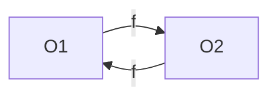

# lecture 13 <div style="text-align:right"> 06/03/2024 </div>

## Garbage Collection

- Memory management is very hard, nobody knows when to free the memory
- OS is one that can allocate and deallocate memory
- mutator (program) can ask for change
- Collector sits between the two

### Reference Counting GC

```java
    a = new();  // O1.rc = 1
    b = a;      // O1.rc++;
    a.f = b;    // O1.rc++;
```

- keep track of number of values that point to the object
- We can add instructions `O1.rc++` when new value points to O1 
- similarly `O1.rc--` if stops pointing to it 
- If reference count goes to 0 then remove it 
- when to do GC?

Limitations
- Extra Computation
- Extra Space ( for the reference count)
- If cycles then have to more careful 



- Both the Objects may not be pointed to by anthing else but their reference count will remain positive

Some Solution
- computation: 
- Size: keep 2 bits, if more than 3 references never free the memory (effective in 1960's)
- Cycles: Initiate a tracing to find unreachable code

### Mark-Sweep GC
- Marking phase (scavenging) and sweeping phase

###### Marking Phase
- Root Set:
    * Stack Variables
    * Static Variables
    * Registers
- We can take a snapshot of the Points To graph and create marking as the objects unreachable will remain unreachable
- We need to stop the world (STW) to do this

###### Sweeping Phase
- More Expensive as we will need to go through the whole heap insteaf of only the reachable one
- It can be done parallely as objects that need to be removed will be marked earlier
- We need to give timestamp to object as we are working with a earlier marking so that we don't delete any new objects allocated in the mean time


**Compaction and defragmentation**
- Move the occupied memory together so that unoccupied is together this will reduce the time to find appropriate size chunk when allocating 

### Mark-Compact / Sweep GC
##### Forwarding Address
- With each cell in memory, store the position where the cell has been moved to 
- If someone refers this cell then redirect them to the new positon, 
- **Redirection Table** To store the forwarding Address, It needs special support, so that it remains in cache


types of collectors
- **Moving Collector** : it moves the references in place
- **Copying Collector** : it copies the references to another place and then program starts pointing to it 
