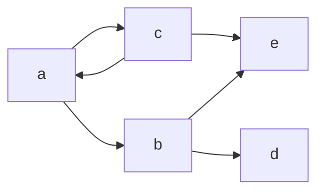
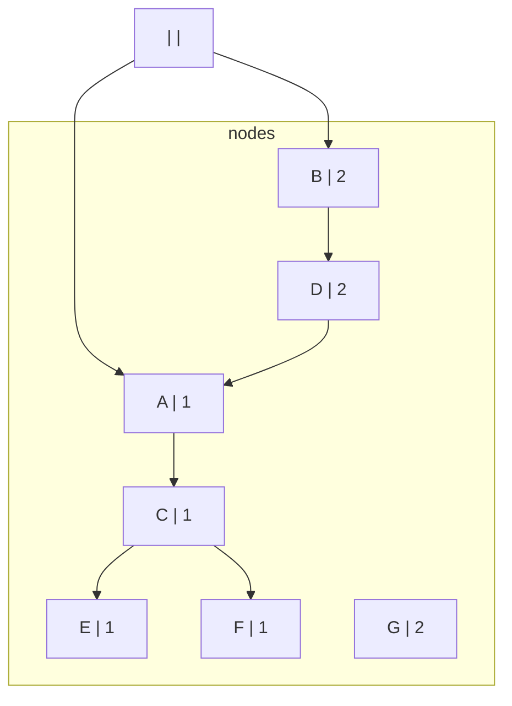
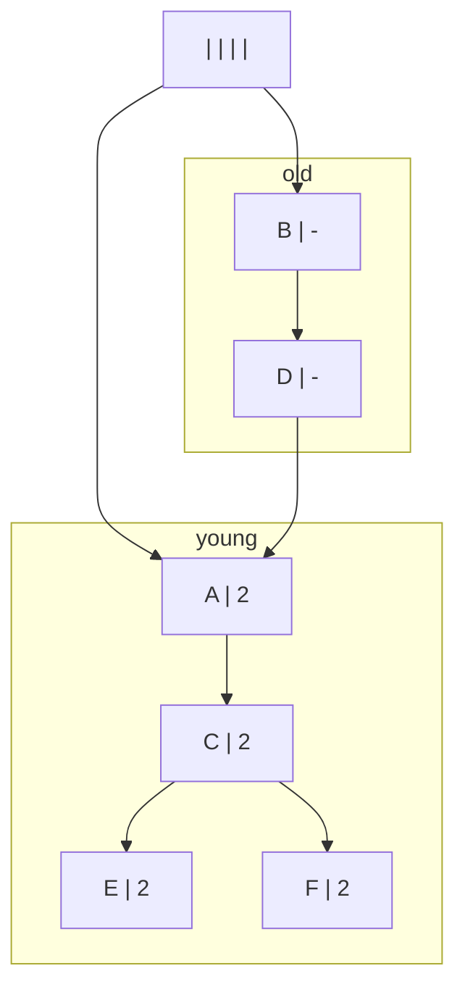

```mermaid
graph LR
    a:::black --> b:::gray 
    a --> c:::gray
    classDef white fill:#fff
    classDef gray fill:#666
    classDef black fill:#000
```

# lecture 14 
 13/03/2024 

1. Reference Counting:
    1. High Overhead
2. Mark-sweep
3. Mark Compact
4. Copying GC

### Garbage collection
- Black: Node and its children copied
- Gray: Node processed but not its children
- Unprocessed node

The From graph is the previous to Graph

### To graphs

```mermaid
graph LR
    a:::gray
    classDef white fill:#fff
    classDef gray fill:#666
    classDef black fill:#000
```

becomes

becomes

```mermaid
graph LR
    a:::black --> b:::black --> e:::gray 
    a --> c:::black --> a & e
    b-->d:::gray
    classDef white fill:#fff
    classDef gray fill:#666
    classDef black fill:#000
```

### Design Considerations
- Spatial Locality of the mutator
    * BFS
    * DFS
    * Program behaviour
- Unnecessary copying of long living objects
    * The long livin object will be copied between to and from multiple times 
- Temporal locality (how small should the size of different spaces be)
    * If the space is large they will be booted out of cache more often 
    * long living object in bigger space which is not collected as often, (maybe it runs mark and sweep once in a while)

## Generational Garbage Collection
Objects that are old are likely to live longer  
whereas objects that are yound are likely to be removed earlier

----------

minor collection : younger generation  
major collection : older generation

when doing major collection , perform a minor collection

### Write Barrier
- `a.f = b` 
- if Ob is from old generation and Oa is from young generation
- we store the point in a intergenerational pointer table

Improvements:-
- No write barriers needed for stores to root set
- If an object O previously pointed to null, then we don't need a Write Barrier during a subsequent store
- Paper by **Detlef and nandiwada** 
