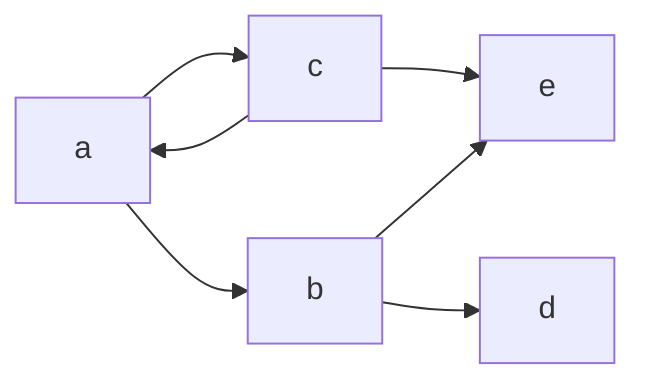

# lecture 15 
 15/03/2024 

Copying GC : from **from** space to **to** space

### incremental GC
do not scavenge the whole heap but only work with one part 
### Concurrant GC 
On two different threads
### real time GC
upperbound on time taken by GC and mutator

suppose the GC is at point

```mermaid
graph LR
    a:::black --> c:::gray --> a
    a --> b --> d:::white
    c & b --> e:::white
    classDef white fill:#fff
    classDef gray fill:#666
    classDef black fill:#000
```

paused the collection step and the mutator runs and changes the graph

```mermaid
graph LR
    a:::black 
    b:::black
    c:::gray    
    d:::white
    e:::white

    a --> b --> d
    a --> e 
    c --> a
    classDef white fill:#fff, text-color:#000
    classDef gray fill:#666
    classDef black fill:#000
```

We work with gray nodes but here a was already processed with all its children so e will never by reached

Incorrect reclamation of white object O
1. A black objects points to O; and 
2. no gray object points to O

## incremental/Concurrant Non moving GC
- incremental Update
    * Dijkstras method:
        + write barrier - trap the store of a white object and mark it gray
    * Stee's method:
        + write barrier - trap the store of a white object and mark the other object as gray
- Snapshot at the beginning (SATB)
    * write barrier - Traps the modification to a white object and pushes the pointer to a "mark stack"

## incremental/Concurrant Moving(Copying) GC
- Mutator makes a allocation request
    * don't know at what time will the copying be done so where should be free pointer be
- Read of an unprocessed objects from From Space
    * read barrier : trap the read of a white object, copy that to TOSPACE, and then continue;
- Avoiding one of the previous two conditions
    * make white objects gray

## Parallel GC
The GC itself has multiple threads
## Distributed GC
Nodes in different threads
## Compiler Guided GC
knowing about the compiler and the language

# Assignment 3
- Acyclic call graph
- no global variables
