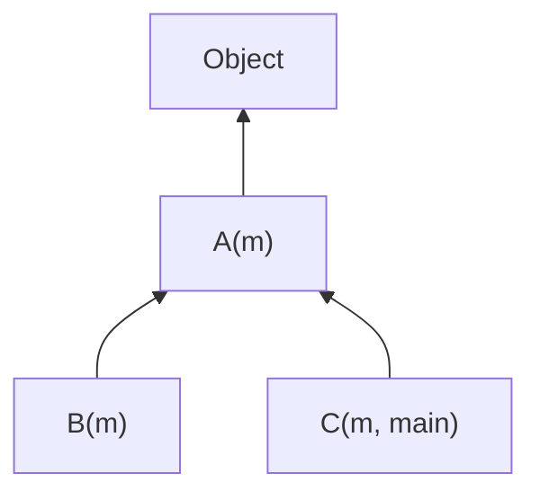
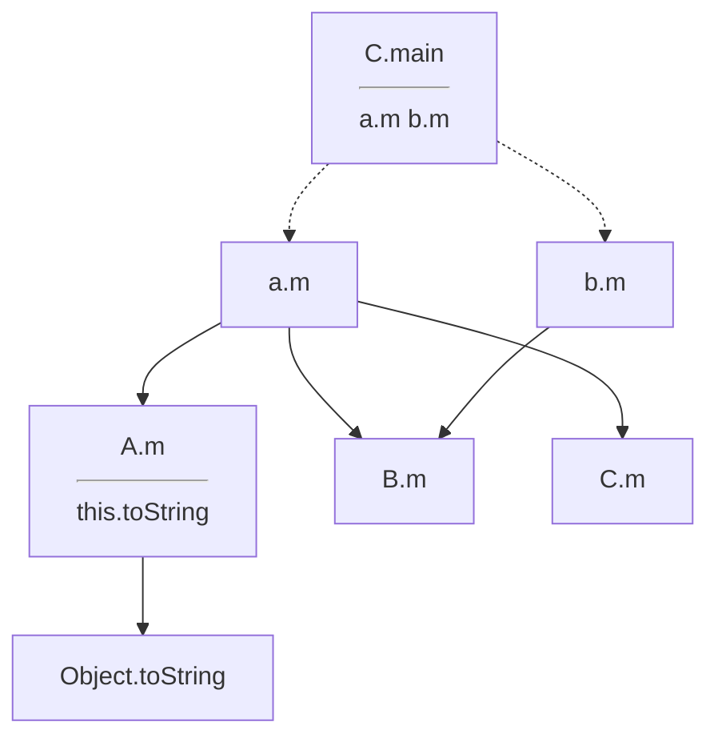
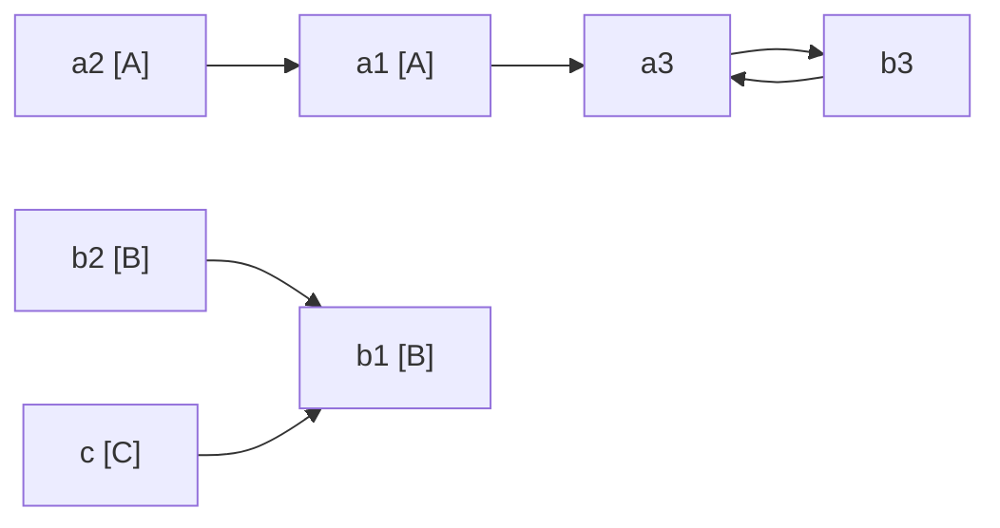
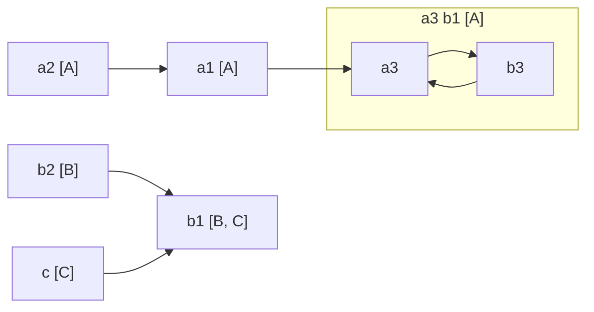
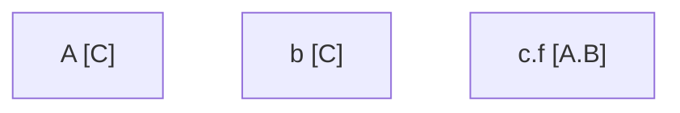

# Lecture 16 <div style="text-align:right"> 20/03/2024 </div>

## Invoke
- virtual invoke : 
    + we get to know the method at run time, need to go through the whole method call steps
- static invoke : 
    + we know the method body at compile time, the method invoke method can be replaced by a jump


## Class Hierarchy Analysis (CHA)
```java
class A {extends Object} { // if no parent then Object is parent
    String m(){
        return this.toString();
    }
}

class B extends A {
    string m(){ ... }
}

class C extends A {
    string m(){ ... }
    public static void main(...){
        A a = new A();
        B b = new B();
        string s; 
        ... ;
        s = a.m();
        s = b.m();
    }
}
```

Class Hierarchy


the Call Graph possible is 


- Monomorphic : know only one method can be called
- Polymorphic : Many method can be called

## Rapid Type Analysis (RTA)
- Get the type of analysis rapidly
- > pessimistic : you would scan the whole program and the program can not change
- > Optimistic : possible that the class c may come later
- Class C is never initiated so remove the edge

Advantages
- if possible that C.m Can call many process, if know if C is not used then all methods are removed
- Walking through v-tables become faster
- Code can be deleted so the code size becomes smalle

Direct Class Load
- Only load a class when the object is needed (initiated or static method calling)

## Variable Type Analysis (VTA)
```java
A a1, a2, a3;
B b1, b2, b3;
C c;
a1 = new A();
a2 = new A();
b1 = new B();
b2 = new B();
c = new C();

a1 = a2;
a3 = a1;
a3 = b3;
b3 = (B)a3;
b1 = b2;
b1 = c;
```

- first using the new statements add the type to the variable set  
- Then add edges depending on the assignment
- Create a TPG (type propogation graph)



- collapse the cyles and then put the sets that are needed



when checking the function possible only check the classes in set

Graph
- variable has a node
- field has a node
- argument has a node
- parameeter has a node

for a `a = bar()`, create a type variable for return statement `a = ret_bar`

```java
class C{
    A f;
}

main(){
    a = new C();
    a.f = new A();
    b = new C();
    b.f = new B();
}
```




Context Sensitve
- We merge all the locations that can call the function 
- eg for context insenstive: `foo(5, 10)` and `foo(2, 4)`
    * if `foo(p, q){return p * q}`
    * then we can say `p = {5, 2}` and `q = {10, 4}`
    * then we have that foo can return `50, 40, 20, 8`, all possible permutations of the input
- if it is context sensitive then we will pair up the current context and will increase precision

