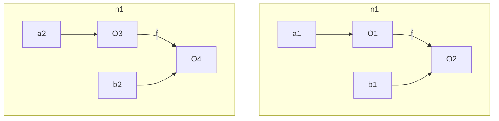
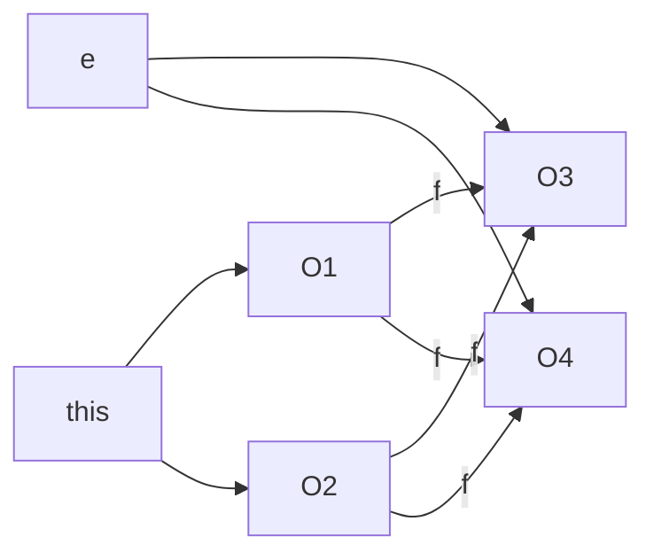

# Lecture 17<div style="text-align:right"> 22/03/2024 </div>

## Object Sensitive Analysis

```java
class A{
    B f;

    void setF(B e){
        this.f = e;
    }

    B getF(){
        return this.f;
    }
}

// B extended by class C
// Both have a method bar

```

```java
A a1 = new A(); // O1
B b1 = new B(); // O2
a1.setF(b1);
A a2 = new A(); // O3
B b2 = new C(); // O4
a2.setF(b2);

t1 = a1.getF();
t1.bar();
t2 = a2.getF();
t2.bar();
```

points to graph looks like



For setF well wll have that 


In OOP programming, only the reciever (the caller) will change usually so we can do object Sensitive analysis, dividing on the object that calls a function

ANA MILANOVA : enough to divide the points to graph on `this`
- When setF is Analysed for the first time then the context is `O1`
- On second call of setf, first compare if setF called before, Did we have the same context, If not then Analysed again with new context (O3)

For GetF
- First Time : context is O1 so it will return the O2
- second time : new context O3 so it will return O4


```java
if()
    a1 = new(); // O1
else
    a1 = new(); // O2;
a1.bar();
```
- In this we analyse for both O1 and O2 seperately that is 
- > For Every Object that is pointed to by a variable we do analysis for each object

## second level Analysis (2-plain)
- Object Sensitive Analysis is also called Allocation Site Sensitive Analysis
- first level divide into based on the current object that calls the function

```java
class A{
    void foo(Object o){
        o.func();
    }
}

class Client{
    void bar(A a1, A a2){
        a1.foo(someObj);
        a2.foo(someObj);
    }
}
```

- we don't know class of `a1` and `a2` but can say they will be in class hierarchy of A
- In second level analysis we will also have the type of the object that calls the current function
- so Level are
    * 1st level : Object of Type ⊆ A
    * 2nd level : Object of Type ⊆ Client

This changes the above analysis as :-
- In only one level analysis then `o.func()` will use the same context for both `a1.foo` and `a2.foo`
- but with two level analysis we will have context as {a1, o} and {a2, o} which are different

## (2-full) second level analysis
- alloc-site of the allocator of the reciever
- Under 2-full the second level would likeliy be ⊆ X where X has no relationship with client
- second level is the class which created the level1 objects
- In above the second level is a class Z which has a statement `a = new A()` where this object is passed to the function bar


## Type Senstive Analysis
```java
class C{
    X m(){
        A y = new A(); // O1
        y.x();
        A z = new A(); // O2
        z.x();
    }
}
```

- for object sensitive we have 2 context {O1, O2}
- For Type Analysis we only have one context {A}

```
    2-obj ⊇ 1 type, 1 Obj = 1 Obj, 1 type ⊇ 2 type
```

types available:-
- Dynamic types of the Object
- Static type of Object (usually bad as no precision)
- X, return type of function (doesn't even make sense)
- Class C (found best)
