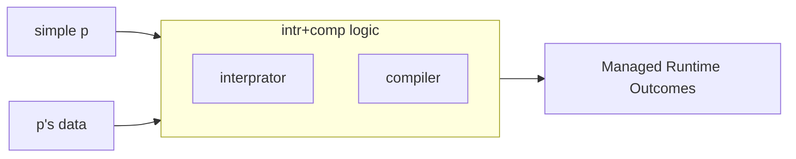
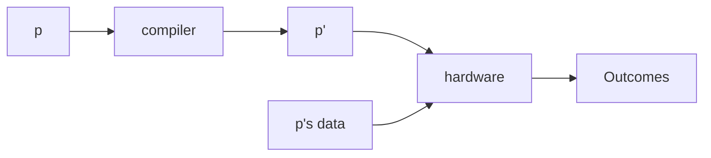
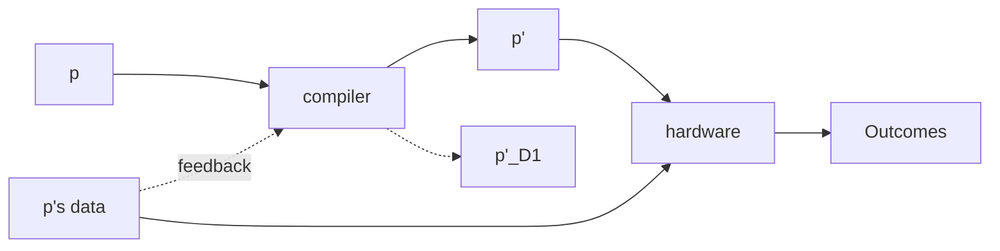

# Lecture 18 
 27/03/2024 

## Intro to Speculation and Deoptimization

#### Difference between Compiler and Interpretor
- Compiler produce more optimized code
- Compiler can be used to remove the source code and only provide compiled code
- Interpretor better for scripting language
- compiler fixes the code and it cannot be changed whereas interpretor allows to change the code as it is running

If the user changes the code, we should start a interpretor,  
But This will restart the whole operation with building AST and doing semantic analysis  
Java Changes to ByteCode. it is easy to understand and change

### JIT (Just In Time) compiler

---------------------------------------------------------

### AOT (Ahead of Time) compiler
If we know information about the runtime then we can optimize the code

### Issues with JIT
- Compilation of JIT may take a lot of time 

### Solution

###### Tiered Compiler
- Do basic compilation (without data)
- Give the feedback to a advanced compiler (will do optimizations knowing input data)

1. AOT + JIT
2. Tiered Interpretor + compiler
3. Jitted Code

Other solution is to start with a interpretor first and use compiler 
when it compiles, The Code that is already ran need not be compiled 
as it will not be called again, the piece of code that is being run 
multiple times should be compiled as compiled code is faster

Have Guards on compiled code that will define the data conditions on 
the incoming data, The compiled code is stored in a compiled code cache 
as there are multiple versions of the code, If a version is not used for
a while then it can be removed
