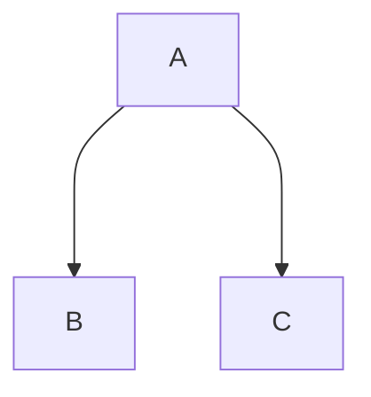

# Lecture 21 <div style="text-align:right"> 10/04/2024 </div>

## Code Versioning

```java
int foo(){
    return Math.sqrt(this.getX() * this.getX() + this.getY() * this.getY());
}
```



Each PIC will have 3 values, one for B, one for C, and one default (lookup)  
There are need for 4 PIC call (each `this.*` call)

There are different versions of foo depending on the type of object
- fooB
- fooC : All calls on this "this" dispatched directly to `C` version

Instead of PICS inside the function, there will be a guard before call site of functions

code versioning is also called customizations

```java
n(int p){
    ... x * p ... 
}

// Instead of multiplication if we know p is 2 majorly
// instead of imul instruction we can use a shl (shift left) instruction
```

- You can garbage collect the versions that are not being used and default to lookup table,
- Put versions in cache
- Optimize at higher level of granularity, instead of value of parameter, we can use type of parameter


## Deoptless Video

## Message Splitting
```java
if(*){
    x = new A();
}
else{
    x = new B();
}
x.foo();
```

to make the call monomorphic put the foo in both branches

```java
if(*){
    x = new A();
    x.foo();
}
else{
    x = new B();
    x.foo();
}
```
