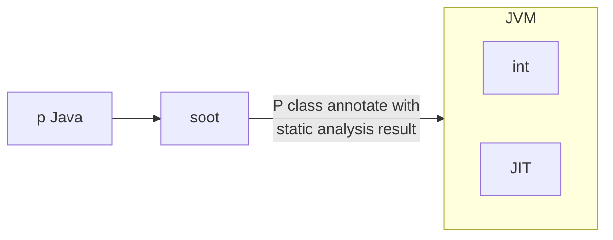
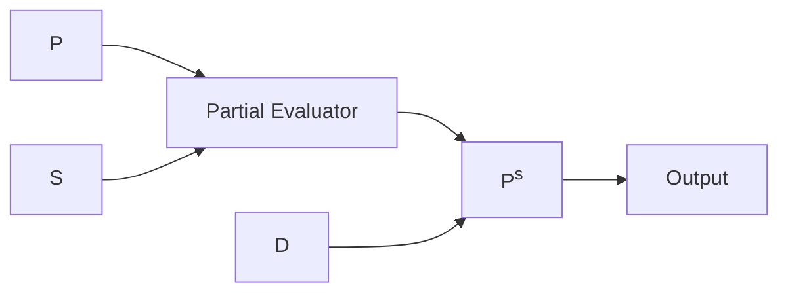

# Lecture 22  <div style="text-align:right"> 12/04/2024 </div>

JITs perform Speculative Optimization



some optimizations are supported by the language, In some optimizations can be made in the bytecode itself


### Inhibit Static Analysis
- Representation of results 
- Partial Program (don't have access to all programs, use many library programs)
- Language features / supported dynamism (eval or reflection)
- runtime dynamism / features (debuggers (changing variables))


## Partial-Program Analysis

```Java
class App{
    void foo(){
        D x = new D(); // O4
        D y = new D(); // O5
        x.f = new E(); // O6
        Lib.bar(x); // Library method, don't have access to it during static analysis
    }    
}
```

- O4 : Escapes
- O5 : Does not escpaes
- O6 : Escpaes

We need to store what the objects depend on during runtime to check if object escapes or not
- es(O4) = {`<Lib.bar, param_1>`}
- es(O5) = D
- es(O6) = {`<Lib.bar, param_1>`, `<Lib.bar, param_1.f>`}

```java
bar(p){
    y = p.f;
    y.g = new E() // O8
}
```

- es(Op_1) = {`<caller, arg_1`}         [First parameter]
- es(O7) = {`<caller, arg_1>`, `<caller, arg_1.f>`}
- es(O8) = {`<caller, arg_1>`, `<caller, arg_1.f>`, `<caller, arg_1.f.g>`}

as the first parameter and first argument in bar depend circularly on each other we can condense them 



