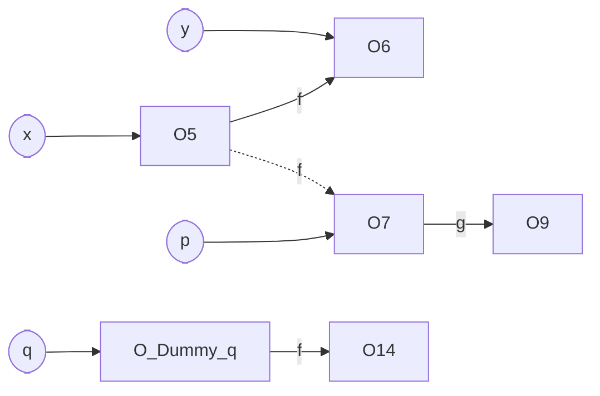

# Lecture 24 <div style="text-align:right"> 19/04/2024 </div>

## Dynamic Class Loading (DCL)
until we don't need the class the class is not loaded
## Hot-code Replacement (HCR)

for each class in code a `Klass/ Clazz` object is created

## Usefull Information-
- ByteCode of Methods
- Shape and size of the class instances
- Attributes (line numbers, annotations, ...)

## Class Initializer `<clinit>`

```java
class A{
    static int f;
    static {
        f = 15;
    }
}
```

code is executed when the class is loaded

```java
main () {
    A a = new B();
}
```
- Allocate memory for B code
- Then `init` call for B
- The reference is stored as A type in stack

```java
class A { B g; }
class C{
    A f;
    void do(C q, C r){
        C x = new C(); // O5
        A y = new Y(); // O6
        x.f = new A(); // O7
        A p = x.f;
        x.f.g = new B(); // O9
        r.zar(p, q);
        bar(x. y);
    }

    void zar(A p, C q){
        q.f = new A(); // O14
    }
    
    void bar( C p1, C p2){
        p1.f = p2;
    }
}
```

interprocedural Point to Graph for foo



- Monomorphic : r.zar, this.bar
- Stack Allocated : O5, O6, O7, O9

A new class D that extends C is loaded in runtime 
```java
void zar(A p, C q){
    q.f = p;
}
```

Now this zar is not monomorphic as both zar of C or D may be called
- Monomorphic : this.bar
- Stack Allocated : O5, O6

#### Loading D
- Deoptimize and recompile (aggresively)
- Move affected objects from stack to heap **Heapify** 
- correct the references (scanning teh registers and walking the stack) `costly`
- atomic heapification, (The parts should not be touched as they are being changed)

This is recursive, (objects which are being pointed to by heapified are also recursive)
It should be atomic


When we see the statement `q.f = p`, which is the point that caused the object to escape, then is the point we want to heapify

##### When to heapify
- let `pointsTo(p) = {O_p}`
- let `pointsTo(q) = {O_q}`

```

if (O_p is in stack){
    if (O_q is on heap) 
        heapify (O_p)
    else if (O_q is on an older stackframe than O_p) 
        heapify(O_p)
}
```

on stack can be checked by comparing the location with stack_start and stack_end  
stackframe can be found by iterating through the stackframes, when we find first, if it is left then heapify
