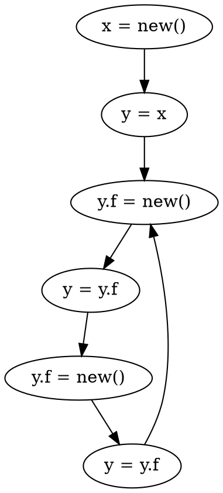
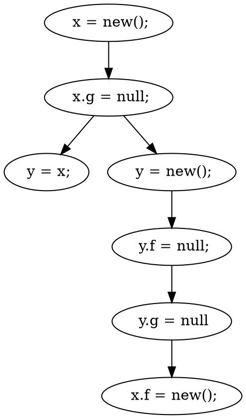

# Lecture 4 <div style="text-align:right"> 17/01/2024 </div>

# Heap Abstractions
- shape of heap is amoeba

```java 
    x = new T();
    y = x;
    while(*){ // don't care about the condition
        y.f = new();
        y = y.f;
        y.f = new();
        y = y.f
    }
```

- first allocate some object on heap that is pointed to be x
- both x and y point to it 
- then heap.f will point to a new location in heap
- y will start pointing to it
- This can go on for a long time

### How do we summarize the heap?
- The summary is finite 
- It is a correct representation of the runtime

#### Kinds of Queries 
1) Alias related question (can x alias with y ?)
2) Points to information (What does x/y points to ?)

#### Types Of Question / Information that can be asked
- May Information (May happen or may not)
- Must Information
- Cannot Information

#### Soundness / Precision

```java
    x = new();
    x.g = null;
    if (_){
        y = x;
    } else {
        y = new();
        y.f = null;
        y.g = null
    }
    x.f = new();
```

Which of references `x.f, x.g, y.f, y.g` may be null?
- absolutely true that x.g and y.g will be NULL;
- x.f will never be null
- y.f may be null;

Say answer given is x.g and y.g
- Then the answer is unsound for may (it should include every answer)

MUST
- the answer is sound for must (Includes all the scenario) and precise (only includes correct answer)
- Any overapproximation is unsound
- An underappointed is unprecise
 
MAY
- the answer is sound for may (Includes all the scenario) and precise (only includes correct answer)
- Any underapproximation is unsound
- An overapproximation is unprecise
 
Say answer is x.g, y.g, y.f
- sound if covers all cases
- precise if it has spurious 

CANNOT

## Access path Abstraction
> v(.f)*  
$f \in Field$
- references variable v and then chain of its fields 
- Storeless model
```java 
    x = new T(); // O1
    y = x;
    while(*){ // don't care about the condition
        y.f = new(); // O4
        y = y.f;
        y.f = new(); // O6
        y = y.f
    }
```
- Heap Summary `<x.f.f,y> , <x.f.f.f.f,y>`
- Pairs can alias with each other `x.f.f, y` alias after 1 iteration
- `<x.f.f.f.f,y>` after 2 iterations
- This can again lead to infinite pairs
### k-limits, only k length of path (k = 2)
- `x.f.f.*, y` is imprecise as it allows x with 3 f which is not allowed 
- `x(.f.f)*, y` is more precise than first one
    * Both Are sound as all possible are in the set 
    * Allows to give alieas questions very easily 
    * not fully precise as while loop may run only one time but we will add all chains of f to the setAllocation

### Allocation site Abstraction
- summarize the heap such that the maximum number of objects bound by maximum number type of allocations site
 
```dot
Digraph G{
    o1[shape=square];
    o4[shape=square];
    o6[shape=square];
    x -> o1;
    <!-- y -> o1; -->
    o1 -> o4 [label=f];
    <!-- y ->o4; -->
    o4 -> o6[label=f];
    y -> o6;
    o6 -> o4[label=f];
}
```
- We achive a fixed point as the summary at end of program will not change

### Control Flow Graph
- NODES : Instructions
- EDGES : flow






