# Lecture 6 <div style="text-align:right"> 24/01/2024 </div>

## Pointer Analysis via IDFA(Iterative Data Flow Analysis)

```java
    a = new A(); // O1
    a.f = new B(); // O2
    a.f.g = new C(); // O3
    c = a.f.g;
    d = a;
    e = a.f;
    p = new A(); // O7;
```

### Points to Graph (PTG)

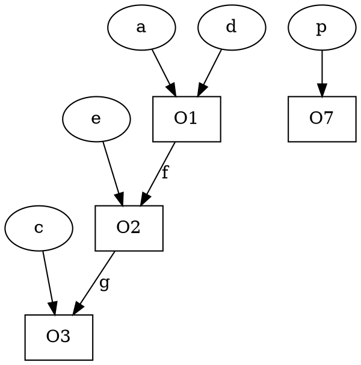

### Initialization
say that the above code is part of a function which has parameters `p` and `q`;  
∀ parameters `p` create a dummy object for each parameter
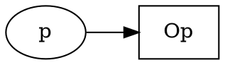


<table>
<thead>
<td> statement </td> <td> Existing </td> <td> Generated </td>
</thead>
<tr>
<td> l -> v </td>
<td> 

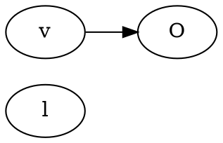

</td>
<td>

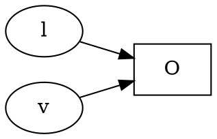

</tr>
<tr>
<td> l1 = l2.f </td>
<td>


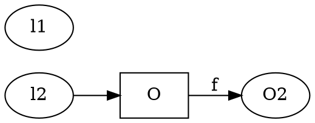

</td>
<td>


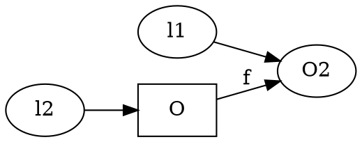

</td>
</tr>

<tr>
<td>
l1.f = l2
</td>
<td>


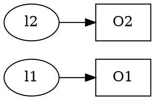

</td>
<td>


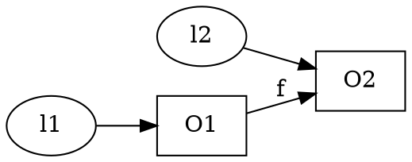

</td>
</tr>
<tr>
<td>
l = new()
</td>
<td>


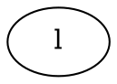

</td>
<td>


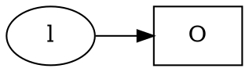

</td>
</tr>
</table>

```java
```

$\text{OUT}(n) = ([(n)]) \text{IN}(n)$


Possible that there is no object l2.f 
- Two Cases:
    * If it is a dummy object then it should point to another dummy object (case when they are a parameter)
    * Otherwise if we know it is not initialized then it should be NULL;


### Join Operation
```java
    a = new(); // O1
    a.f = new(); // O2
    b = new(); // O3
    if(*){
        b.f = new() // O4     
        r = a;
    }
    else{
        b.f = new() // O5     
        r = b;
    }
    s = r 
    b.f.g = new() //O7
```

True IF STATEMENT
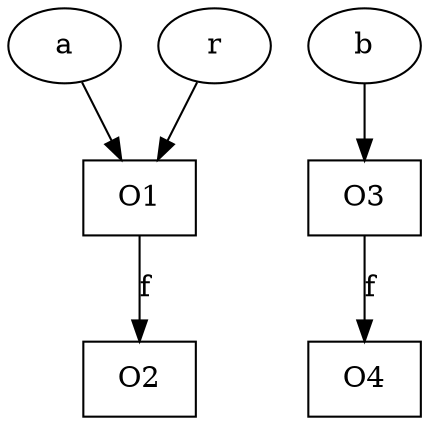

False IF statement
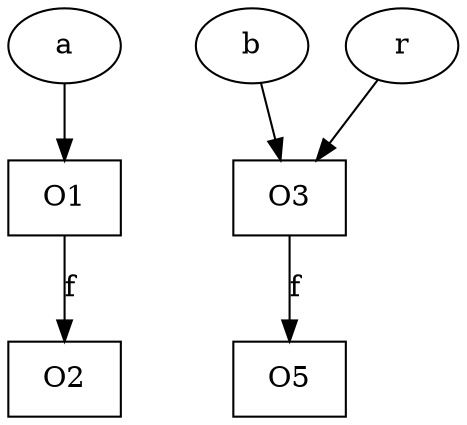


We are working with may point to, So we take the **union** of graph

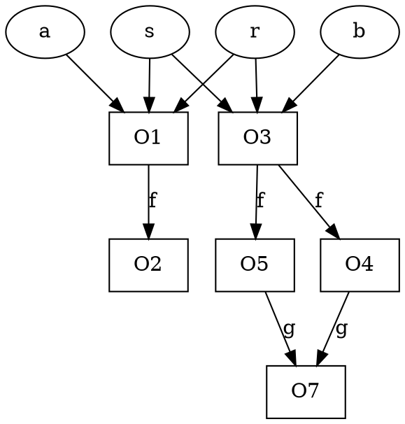

## IDFA 
- Initialize all Ins and outs
- process the entry ( create the dummy objects for all non-primitive )
- Initialize a worklist (list containing all the things need to be done)
    * `W U= Nodes`
- While Worklist is not empty do
    * remove a statement n from the worklist `W = W - {n}`
    * Process the statement 
        + `IN(n) = ∀ U OUT(p)` for all predecessors
        + `OUT(n) = ([n])IN(n)`
    * if OUT(n) changed then add all successors that depend on n to W <br> `∀ s ∈ successors(n) W = W U {s}`

The program stops if:
- There are finite number of entries 
- monotonic number of nodes in graph, Graph only increases
