# Lecture 7 <div style="text-align:right"> 31/01/2024 </div>

<table>
<thead>
<td> statement </td> <td> Existing </td> <td> Generated </td>
</thead>
<tr>
<td> l = v copy </td>
<td> 

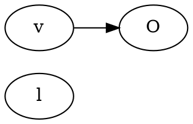

</td>
<td>

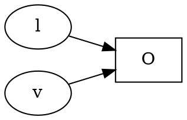

</tr>
<tr>
<td> l1 = l2.f </td>
<td>


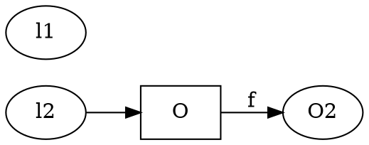

</td>
<td>


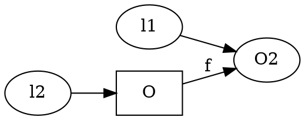

</td>
</tr>

<tr>
<td>

l1.f = l2 `store`

</td>
<td>


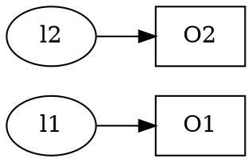

</td>
<td>


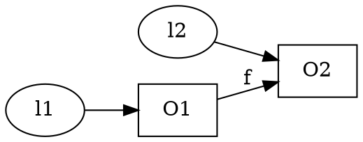

</td>
</tr>
<tr>
<td>
l = new()
</td>
<td>


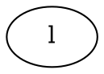

</td>
<td>


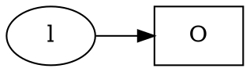

</td>
</tr>
</table>

- for copy, l2.f and new, we can kill the earlier `pointing to` for a flow sensitive analysis

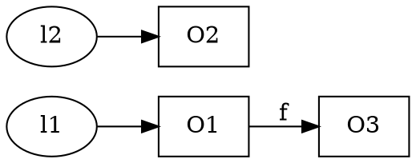
after statement `l1.f = l2`

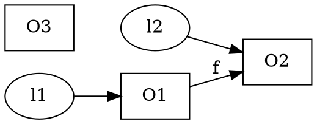
If able to do this then it is called a **strong update** 


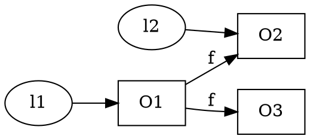
This is called a **Weak Update** 

```java
    b = new() // O0
    while(*){
        a = new(); // O1
        a.f = new(); //O2
        if(#){
            c = a;
        }
    }
    a.f = b;
```

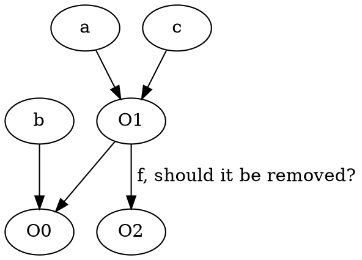

#### strong update
- O1 is locally created nodes
- l<sub>1</sub> points only to O<sub>1
- O1 should be representing only one concrete object (if not we might kill information for all object)


## Intra Procedural analysis
Don't analyse other process or don't have information about other process

```java
    void foo(){
        A a = new A(): // O1
        a.f = new B(); // O2
        A b = new A(); // O3
        bar(a, b);
        // P :
    }
```

1) Do a and b alias?
    1) before call : no
    2) after call : as java is call be value, so no
2) Do a.f and b.f alias?
    1) may be eg bar →  `b.f = a.f`
3) Will b.f lead to null dereference
    1) May be, can start pointing 
4) Assuming O2 is never Accessed again in foo, can it be Garbage Collected(GC)?
    1) May be, some global variable can start pointing to O2 inside bar  

## Inter Procedural analysis

```java
    bar (A f, B q){
        p.f = null;
        q.f = new B() // O11;
        q = new A() // O12;
        z = new B() // O13;
    }
```

1) Do a and b alias?
    1) no
2) Do a.f and b.f alias?
    1) No
3) Will b.f lead to null dereference
    1) No, b.f is the q.f new B()
4) Assuming O2 is never Accessed again in foo, can it be Garbage Collected(GC)?
    1) Yes, no one points to O2

## Analysis
IN(T)
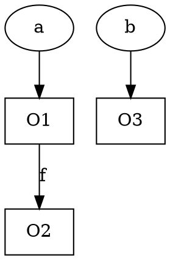
OUT(exit)

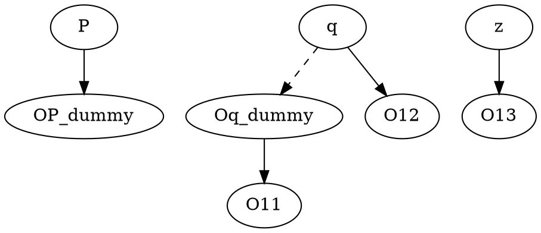
`OUT = MERGE(IN(T), OUT(Exit_bar))`
Merge is not union , local variables need not be used 

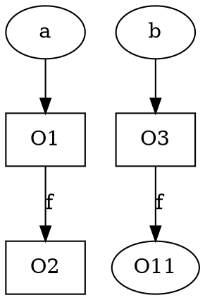
- Start mapping O1 to Op adn O2 to Oq

add to the function bar
```java
    B y = new B(); // O14
    y.g = new C(); // O15
    return y

    // and r = bar(a, b);
```

so the points_to become
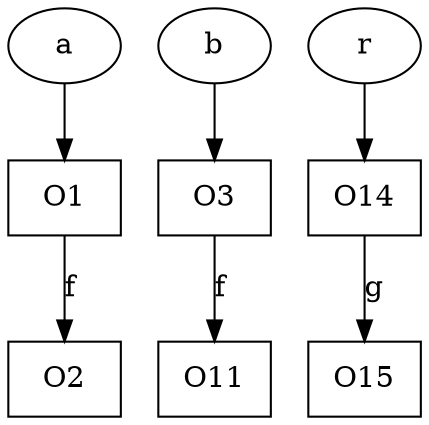

### 

Assume structure is that A is parent of B  
for function `void foo(A x)`

then call `x.bar(a, b)`

```java
    A.bar(Z p, Z q){
        q.f = p.f;
    }

    B.bar(Z p , Z q){
        q.f = new Y(); // O4
    }
```

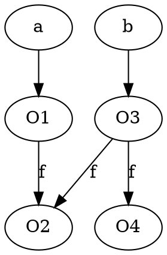
