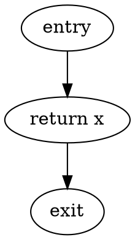
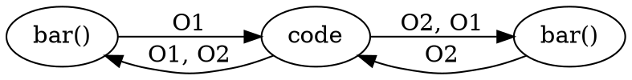
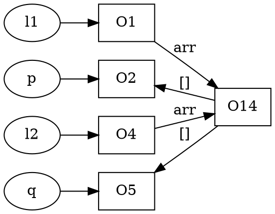
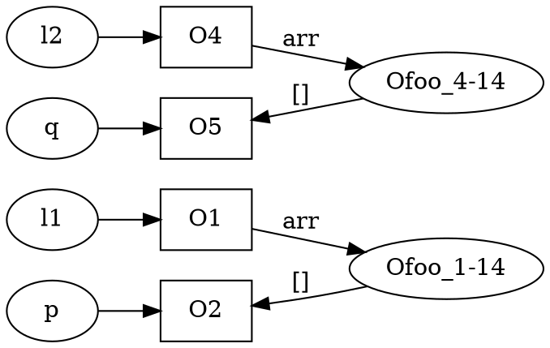

# Lecture 8 <div style="text-align:right;"> 02/02/2024 </div>

## Context sensitive and Heap cloning

```java
    foo(){
        A y = bar(new A()); // O1
        A z = bar(new A()); // O2
    }

    bar(A x){
        return x;
    }
```

Control flow graph of `bar`


exploding the control flow graph of bar to include the caller 

1. the x in bar points to O1 and O2
2. The returned value is O1 and O2
3. so both y and z point to O1 and O2
4. So we lost precision



4 interprocedural paths 
- 2 valid paths
- 2 invalid paths

### Idea
1. make two copies of bar and then both bars will have different context   
but if there are function calls inside function calls, leads to exponential context strings
    - K-call string : allow only k length string when making context
2. Make a summary where the function is turned into a template where given a input we change to get the output
    - But not always possible if the graph changes depending on the input
3. do not merge all the context inside the function 
    - remember where the result comes from 
        * like foo_1 : x -> O1
        * foo_2 : x -> O2
    - When return the result check from where the 


```java
0:  t = new A();
1:  A y = bar(t);
2:  A z = bar(t);
```

by current approach there will be 2 contexts `foo_1` and `foo_2`


```java
    class ArrayList<E>{
        E[] arr;
        ArrayList(){
14:           this.arr = new E[SIZE];
        }

        void add(E e){
            // .. size checks
            this.arr[length + 1] = e;
        }

        E get(int k){
            return this.arr[k];
        }
    }


    void main(){
1:        ArrayList l1 = new ArrayList<A>();
2:        A p = new A();
3:        l1.add(p);

4:        ArrayList l2 = new ArrayList<B>();
5:        B q = new B();
6:        l2.add(q);

7:        l1.get(0).foo(); // A.foo()
8:        l2.get(0).foo(); // B.foo()
    }
```



Both the foo at end can point to both A and B, so lost precision
- DO heap cloning

### Heap Cloning
- instead of just naming object with line number, enrich the name
- so instead of O1 we will name the variable O<sub>foo_4-1</sub>



now at end when calling foo, the correct type of variable is found and we have no problem
