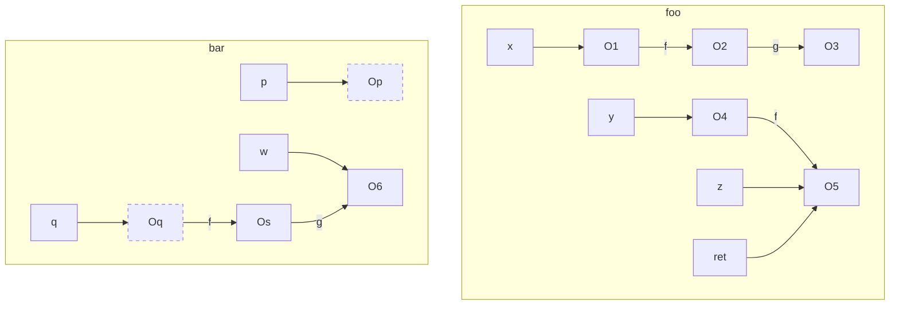
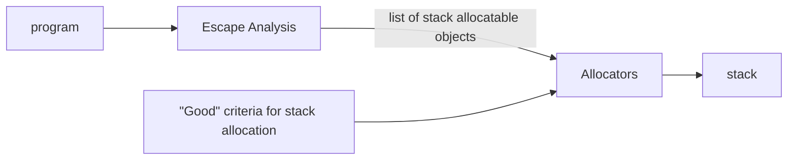

# lecture 9 <div style="text-align"> 07/02/2024 </div>

- Java is Great
- Never worry about deallocation (done by garbage collector)
- Allocation is done by only `new`
- Java is great due to **Escape Analysis** 
- Heap allocation is by default

### Advantage of stack alloc
- Better cache locality : more data is packed togeher so no cache misses
- Easier deallocation : remove all variables in activation record
- Faster allocation : no need to scan heap to find empty space
- Faster field access : Directly use offset instead of going through object

### access object after method dies
It is said that the object "escapes" the method
- Return the location of the object `return obj`
- global variable
- parameter change, eg: `this.f = a`
- Intraprocedural analysis, like `bar(a)`, if the bar allows to escape then possible
- say `a.f = new B()`, that is objects that are reachable from escaped object

###### Example
```Java
    
    static A global;

    A foo(){
        A x = new (); // O1
        x.f = new (); // O2
        x.f.g = new (); // O3
        A y = new (); // O4
        A z = new (); // O5
        y.f = z;
        bar(x.f, y);
        return y.f;
    }

    void boo(p, q){
        A w = new (); // O6
        q.f.g = w;
        global = p;
    }
```

- `O1`: on stack of foo
- `O2`: on heap as assigned to global
- `O3`: on heap because it is reachable from O2
- `O4`: stack of foo
- `O5`: heap as y.f is returned | or if possible stack frame of caller
- `O6`: heap as reachable from O5




```java
    A foo(){
        // ......
        z = new (); // O5
        y.f = z;
        bar(x.f, y);
    }
    
    // changes to due to inlining
    A foo(){
        // ......
        z = new (); // O5
        y.f = z;
        A bar_w = new(); // O6
        y.f.g = bar_w;
        global = x.f;

    }
    
```

-- *We can pass the escaped objects as parameters which can be stored on stack* 


