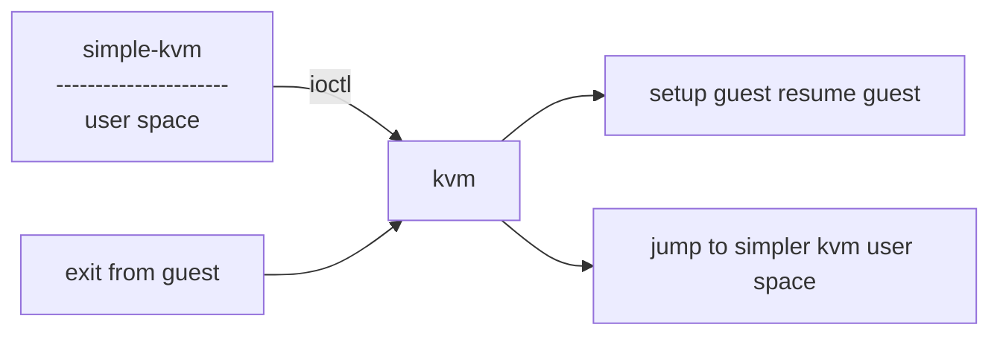
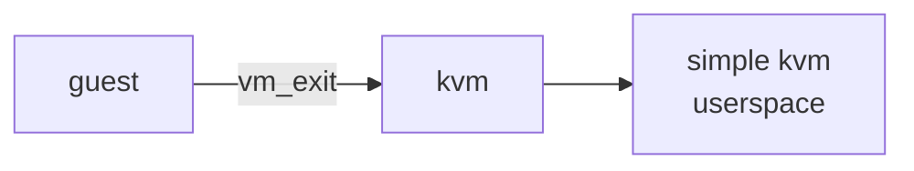

# lecture 10 <div style="text-align"> 09/02/2024 </div>

Let the guests on the machine be named
- Guest16
- Guest32
- Guest64

```
    --|---------------|----------|------------|----------------------
        simple-kvm       guest16   simple-kvm    guest 16
        root-mode vmx   non-root
```


Same process sometimes runs as guest or simple-kvm





## simple-kvm
- set-mode:
    * real / protected / paging/ long
- vm_init
- repu_init
- run vm:
    * lauch the vm and handle exit conditions
