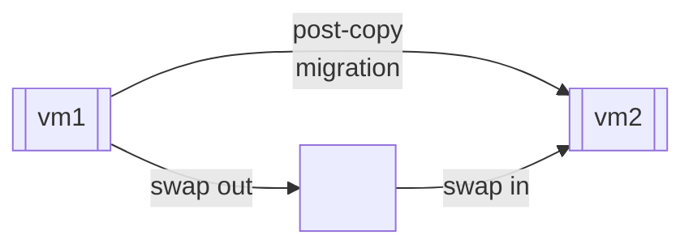
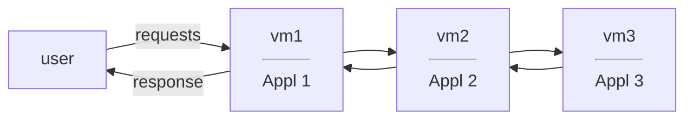

# lecture 14 <div style="text-align:right"> 06/03/2024 </div>

- papers [memmgmt] and [livemigration]

[memmgmt]
- building on the VM primitive
- Ballooning (context based sharing)

[livemigration]
- Save and restore/copy
- iterative pre copy
- post copy migration
- downtime and migration time 
- DT, MT = f(memory size, writeable working set size, dirty rate, network bandwidth/migration rate)
- live migration happens on guest physical address




- first inflate balloon in guest to force blocks into memory then call for migration

### [sandpiper] [remus]
- vm based provisioning and management
- cloud service providers data centers 
    * public: eg google, amazon
    * private (enterprise)

##### data Centers
- cluster which contains racks
- racks have servers
- TOR - top of rack interconnected
- router connectes all TORS
- A data center can have multiple clusters
- each server can have multiple vms running

## Service Provider
- Provide execution environments (VMs) for applications
- Cloud/Servide Provider:
    * cost 
    * utilization


| Functional     | Performance    |
|--------------- | --------------- |
| isolation      | SLA  (service level agreement)  |
|                | SLO  (service level objective) |
|                | throughput Latency   |


- Use Performance to resources correlation to determine resources needed
- specify SLA and provider assures all resources to meet SLA
    * eg: maintein 200 requests/second
    * 99th percentile response time < 50ms

### [sandpiper]
- network applications 



- dynamic workload

#### hotspot
- enough resources allocated to a VM -> SLA violated
- if aggregate resource demand > capacity of physical machine

1) monitoring and profiling
2) Hotspot detection
3) resizing and migration

|     | black box    | gray box    |
|---------------- | --------------- | --------------- |
| cpu | xenmon top ~ tapped into vm scheduling events <br> eg cpu util pper vm    | |
| network disk IO: | through the virtual IO backend driver | |
| Memory : | sample + invalidated => working set estimate <br> swap rate / VM | |

``` 
    if (k + 1th util > threshhold & k > n)
        HOTSPOT;
        u_{k + 1} = u + \phi * (u_k - u)
        u : mean
        phi: bias factor
```

$\lambda_{cap} =\frac 1S$   
$\frac {\lambda_{peak}} {\lambda_{cap}} = \#cpus$
