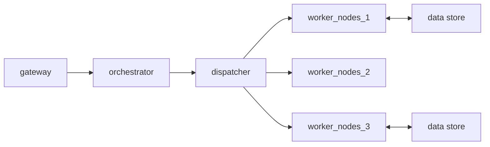

# lecture 17 <div style="text-align:right"> 20/03/2024 </div>

### Containers
- Chroot, unshare, clone, ncenter (local root filespace namespace)
- cgroups (cgroups for resource allocation)
- seccomp (capabilities)


prctl
- Operations on a process
- add/remove filters (filter system call invocations)

## serverless computing
- no-server
- less of server

## Cloud computing
- compute-as-a-service : available consumed on the network/internet
- to manage for the developer/user

```
              Platform              functions
IAAS           Paas                  Faas           SAAS
-----------------------------------------------------
VMs            developement
PMs           platform (IDE / SDK env)
```

- Faas : Functionality / functions subwork microservice
    * Decouple appliction developement from deployment

## architecture of faas


- function registration : developement registration (+ deployment)
- triggers registration for each function
- gateway: HTTP req. ,PubSub/Application system


## Problem Areas
- Execution runtimes for the application/function as a service:
    * Containers
    * lightvms
    * process isolation
    * unikernals
- Data handling
