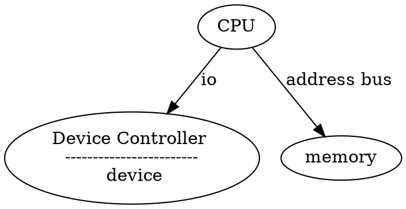

# Lecture 8 
 02/02/2024 

### Device 
- Mechanical 
- electrical 
- electronic

### Ways to access devices from the CPU
1) PIO : Programmed IO
    1) ISA instructions to be issued by the CPU for IO 
2) MMIO : Memory map IO
    1) map memory regions to IO regs 
    2) memory interfaces ⇒ IO access
3) DMA : Direct memory access
    1) for copying data to/from memory to device mem/register 

eg: disk interfaces
- reg x ← block number
- reg y ← read/write
- reg z ← address virtual 
- in/out ← instructions

## generalized IO virtualisation view

    ------------------------- vm                                    
    Application             |                                      |----> user space io handler program
    --------------------|----                                      |            |
                        | IO syscall                               |            |
                        V                                          |            |
    -------------------------                                      |            |
    FS-> guest device driver |                                     |            |
    -------------------------                                      |            |
                                                                   |            |
    --------│------------------------------- Virtual Device        |            |
            │ vm_exit / trap hypervisor                            |            |
            ↓                                                      |            |
        ---------------------                                      |            |
        device driver tracked - trap Handler                       |            |
        ---------------------                                      |            |
            |                                                      |            |
            V                                                      |            |
        ---------------------                                      |            |
            device emulation - virtualize the IO action -----------|            |
        ---------------------                                                   |
            |                                                                   |
            V                                                                   V
        ---------------------                                            --------------
            Device driver <-------------------------------------------------IO stack
        ---------------------                                            --------------
            |
        ----|--------------------- Physical device interface
            V
        ---------------------
            Physical Device
        ---------------------

guest -> file = freach(fd, 100x512, buf);  
copy(buf, dest);

- Emulated IO
    * VMM emulates the full device specification
    * 1:1 guest device vmm physical device
    * need to understand and implement/virtualization each action config state setting
- PV IO
    * split device driver model
- Hardware assisted
    * IO multiplexing - virtualisation
