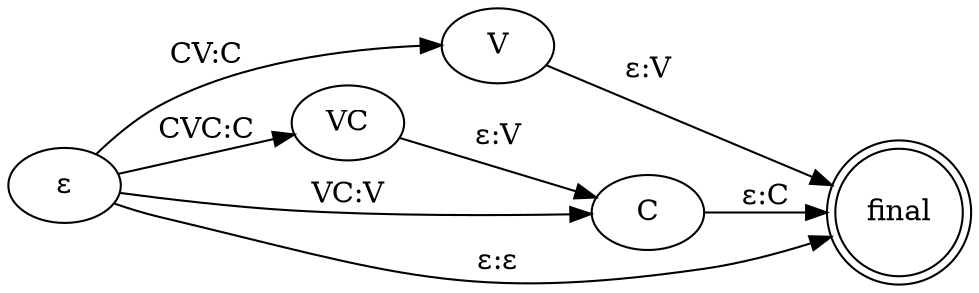
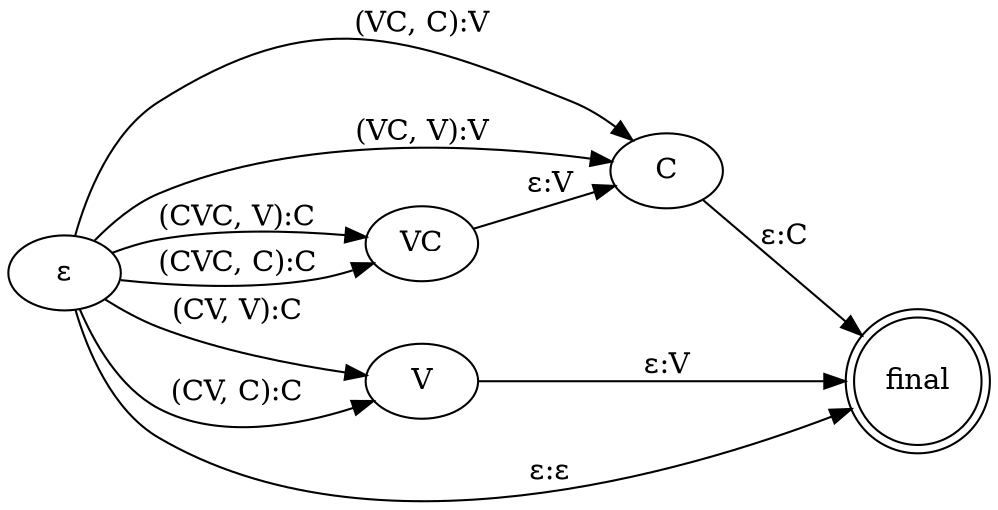
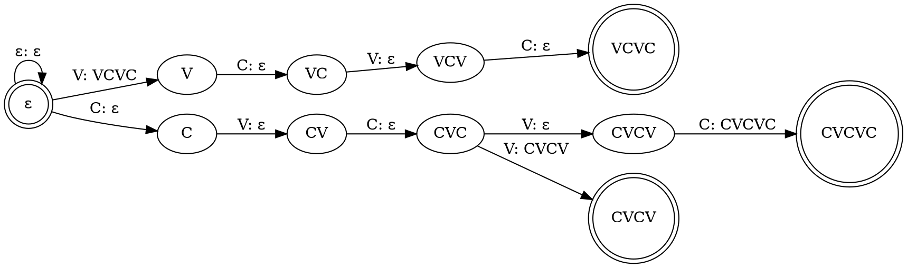

```dot
digraph G{
    graph[rankdir = "LR"]
    a0[label = "ε"]
    a1[label = "C"]
    a2[label = "V"]
    a3[label = "VC"]
    a4[label = "final", shape = doublecircle]
    a0 -> a1 [label = "VC:V"]
    a1 -> a4 [label = "ε:C"]
    a0 -> a2 [label = "CV:C"]
    a2 -> a4 [label = "ε:V"]
    a0 -> a3 [label = "CVC:C"]
    a3 -> a1 [label = "ε:V"]
    a0 -> a4 [label = "ε:ε"]
}
```

```dot
digraph G{
    graph[rankdir = "LR", ordering = "in"]
    a0[label = "ε"]
    a1[label = "C"]
    a2[label = "V"]
    a3[label = "VC"]
    a4[label = "final", shape = doublecircle]
    a0 -> a1 [label = "(VC, C):V"]
    a0 -> a1 [label = "(VC, V):V"]
    a1 -> a4 [label = "ε:C"]
    a0 -> a2 [label = "(CV, V):C"]
    a0 -> a2 [label = "(CV, C):C"]
    a2 -> a4 [label = "ε:V"]
    a0 -> a3 [label = "(CVC, V):C"]
    a0 -> a3 [label = "(CVC, C):C"]
    a3 -> a1 [label = "ε:V"]
    a0 -> a4 [label = "ε:ε"]
}
```

```dot
digraph G{
    graph[rankdir = "LR"]
    a0[label = "ε", shape = doublecircle]
    a1[label = "V"]
    a2[label = "VC"]
    a3[label = "VCV"]
    a4[label = "VCVC", shape = doublecircle]
    a5[label = "C"]
    a6[label = "CV"]
    a7[label = "CVC"]
    a8_1[label = "CVCV"]
    a8[label = "CVCV", shape = doublecircle]
    a9[label = "CVCVC", shape = doublecircle]

    a0 -> a0 [label = "ε: ε"]
    a0 -> a1 [label = "V: VCVC"]
    a1 -> a2 [label = "C: ε"]
    a2 -> a3 [label = "V: ε"]
    a3 -> a4 [label = "C: ε"]

    a0 -> a5 [label = "C: ε"]
    a5 -> a6 [label = "V: ε"]
    a6 -> a7 [label = "C: ε"]
    a7 -> a8 [label = "V: CVCV"]

    a7 -> a8_1 [label = "V: ε"]
    a8_1 -> a9 [label = "C: CVCVC"]
}
```
