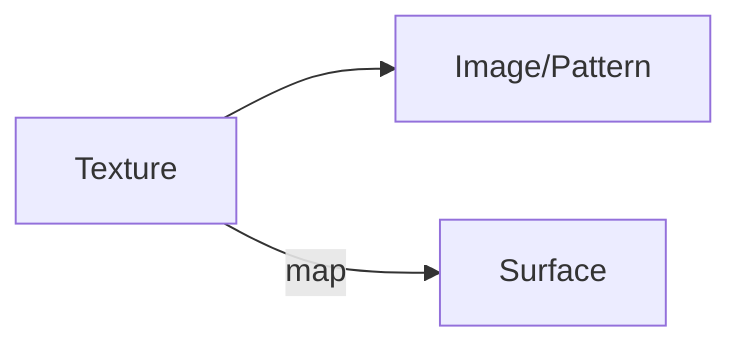

# lecture 12 <div style="text-align:right"> 16/02/2024 </div>

## The volume Rendering Integral
- Evaluate along a ray
- No scattering - no reflections, refractions
- eg: CT scan, images lined on top of each other

## Scalar data visulaizations
- Colour Mapping $f(s) = c
- Map scalar value to a colour range
    * Colour Look-Up Table or LUT
    * Transfer functions

```
                       c''       c'     c
    (< -----o-------o--|------o--|----o-|----o
        c1,a1   c2,a2     c3,a3   c4,a4  cb,ab
```

- $c' = c_4a_4 + c_b(1 - a_4)$
- $c'' = c_3a_3 + c'(1 - a_3)$
- $c = c_1a_1 + (c_2a_2 + (c_3a_3 + (c_4a_4 + c_b(1-a_4))(1 - a_3))(1-a_2))(1-a_1)$

Evaluate along ray
- If there is constant absorption along the ray, amount of radiant energy reaching the eye $c' = c. e^{-kD}$
- If absorption __TODO__
- $$I(D) = I_0e^{-\tau(0, D)} + \int_0^Dc(t)e^{-\tau(0, t)}dt$$
- __TODO__ (read slides for more formula)

## Ray casting
- Alpha compositing/blending with the optical depth approximated by opacity
- $$A_i = 1 - e^{-k(i.\Delta t)\delta t}$$
- $$\tilde C = \sum_{i=0}^{N}C_i\prod_{j=0}^{i-1}(1 - A_j)$$
- Doable in OpenGL, has hardware support
- 3D textures can hold the data in GPU memory

## Texture Mapping


- Image to 
- Texture coordinates / uv coordinates
- vertex of the mesh of objects
- Read about texture mapping and level of details from graphics course;

## shear wrap (*depreciated*)
- No need to know the direction of camera
- Shoot rays in a particular direction
- Shear the volume to have projection on some intermediate plane (usually the first layer)
- Wrap the projection to the camera plane
